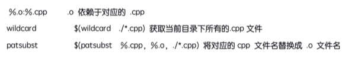

## _*1 . makefile中的伪目标(.PHONY:clean)*_

>> 声明到伪目标之后，makefile将不会判断目标是否存在或者目标是否需要更新;
>> 避免Makefile中定义的执行命令的目标和实际文件名冲突
>>

## _*2 . 模式匹配――%目标:%依赖*_

#### %是目标和依赖的相同部分的通配



## _*3 . 一个模式匹配的案例*_

```
%.o : %.cpp
	$(CXX) -c $^ -o $@
```

上面代码的模式匹配可以代替下面代码的方案，前提是你已声明了查找的规则

```
add.o : add.cpp
	$(CXX) -c $^ -o $@


main.o : main.cpp
	$(CXX) -c $^ -o $@
```

```
# 这里是你已声明的规则
OBJ = add.o main.o(或者写OBJ =  $(patsubst %.cpp, %.o, $(wildcard ./*.cpp)))
TARGET = main
```

#### 替换命令

```
SRC := main.c add.cpp
OBJF := $(SRC:.cpp=.o)
all:
	@echo "SRC = $(SRC)"
	@echo "OBJF = $(OBJF)"
```
